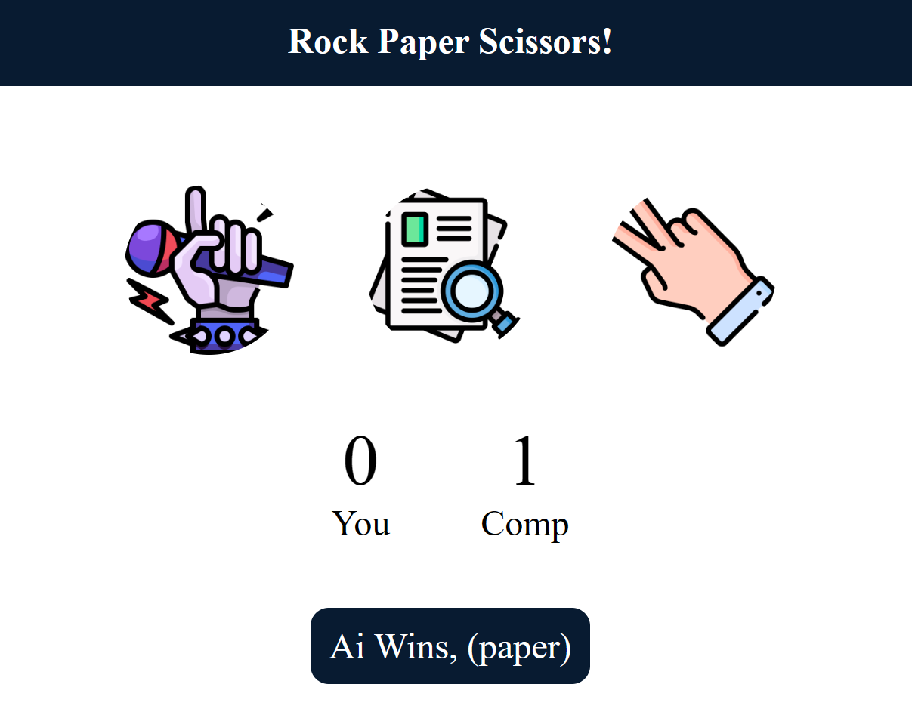

# Rock-Paper-Scissors
This is a simple Rock, Paper, Scissors web game where you can play against the AI. The AI randomly selects an option, and when you click on the images, it displays the winner and updates the score accordingly.

### How to Run?
To play this game in your own browser, simply copy the GitHub repository and open the index.html file by double-clicking.
To clone this Git repository, use the following command:
```py
git clone https://github.com/zXayz/rock-paper-scissors.git
```
## Example Pics

